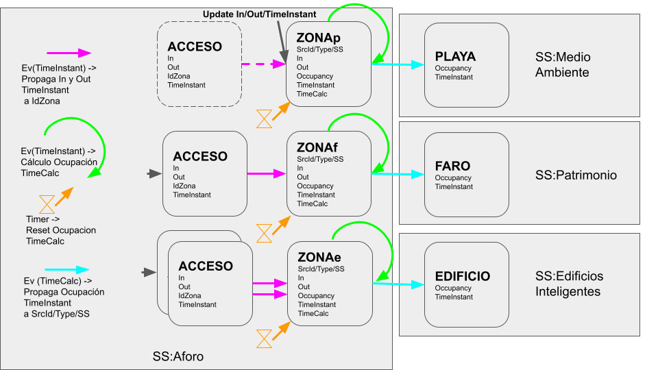

# counting-vertical

Este directorio contiene las herramientas e información necesarias para la instanciación del vertical de aforo.

El vertical de aforo es genérico; las entidades creadas en este vertical son entidades intermedias para el conteo. A pesar de que las entidades cuentan con múltiples atributos, y en algunos casos pueden ser suficientes para representar los objetos aforados, estas entidades no tienen vocación de ser directamente utilizadas en los paneles o el comandado. Estas entidades actuarán generalmente como acumuladores para entidades de otros verticales.

Las entidades calculan la ocupación de una zona en función del flujo de entradas y salidas por sus diferentes accesos, y actualizan con los totales alguna entidad en un servicio externo, que es la que realmente representa el objeto controlado.

Como entidades intermedia, estas entidades no siempre necesitarán ser almacenadas en base de datos. En los casos en los que se utilice esta vertical para alimentar las entidades de otras verticales, no se recomendaría persistir las entidades de este vertical (sería información redundante).

Nombre de subservicio a usar para este vertical: `/aforo`. Observar que en el caso de usar este vertical en modo mancomunado este subservicio vendrá precedido del nombre del scope.

## Changelog

TBD.