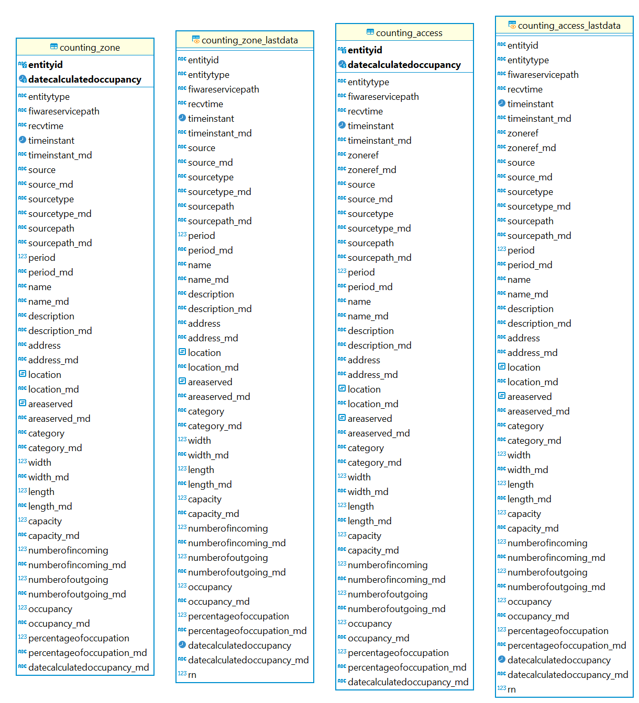

# Descripción del modelo de datos

## Modelo



(Fuente: extracción de diagrama desde lab.urbo2.es servicio alcobendas con [DBWeaver](https://dbeaver.io))

## Inicialización de la base de datos

Es necesario ejecutar el script de las DDLs.

Para ello podemos utilizar el siguiente comando de psql (CLI para PgSQL):

```
psql -h mi_host -p mi_puerto -d mi_db -U mi_usuario -f beaches-vertical/model/db/ddls.sql -v target_schema=esquema
```

Notas:

* Se incluye una selección de flags como ejemplo, algunas podrían no ser necesarias o podrían faltar otras, dependiendo del entorno.

* La flag -f indica la ubicación del script con las DDLs para el vertical. Esto es un ejemplo y puede variar según el entorno, es necesario conocer previamente donde se ubica el script deseado.

`target_schema` es la variable que define el esquema de destino de las diferentes tablas, el valor de la misma formará parte del nombre de otros elementos como índices, claves primarias, etc. De forma que sea más fácil identificar a qué esquema/servicio pertenecen.

En caso de tener un servicio **mancomunado**, donde un varios municipios pueden compartir los mismos paneles de urbo2 dentro del mismo servicio, pero cada uno con sus datos, habría que ejecutar el script de la siguiente manera:

`psql -h mi_host -p mi_puerto -d mi_db -U mi_usuario -f beaches-vertical/model/db/ddls.sql -v target_schema=esquema -v scope=mi_municipio`

`scope` identificará al municipio y creará un prefijo en las tablas (y claves primarias) de tal manera que cada municipio tenga sus propias tablas y vistas propias del vertical

En aquellos casos que se necesiten más niveles de anidamiento (e.g. comunidad autonoma/provincia/municipio/vertical) bastará con definir la variable scope como una concatenación de los niveles que se quieran meter (e.g. scope=leon_molinaseca)

## Descripción de las tablas

El vertical de conteo se compone de las siguientes tablas en el datasource PostgreSQL:

### tablas

* counting_access: Recopila información de los accesos.
* counting_zones: Recopila información sobre las zonas.

### vistas

* counting_access_lastdata: agrupa los últimos datos recogidos en counting_access.
* counting_zones_lastdata: agrupa aquellos últimos datos recogidos en counting_zones.
